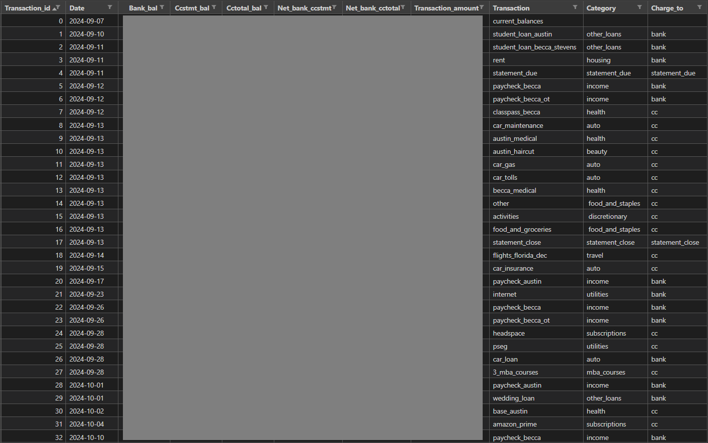

# personal-finance-tracker

## Overview:
Completely automating my personal finances, cash flow planning, and analytics.

### Usage:
Set up a ~/.finances folder (I'll probably add something to automatically set this up in the future with dumby/template numbers to be filled out, as several people have already utilized at least some aspects of this project), then simply run main.py.

 
~/.finances folder containing subfolders for:
1) current_balances - Current balances for all bank, credit card (statement and total), and investment accounts. This
2) projected_cash_flow - Output folder where future cash flow projection .csv files are saved
3) recurring_transactions - All recurring expenses, payments, and income and their amounts, frequencies, exact pay dates, etc.
   Examples: Rent, car payment, paychecks, food (amortized), annual subscriptions
5) supplemental_transactions - Upcoming, non-recurring, larger expenses that need to be manually input
   Examples: Flight purchase, tax return, vacation
   
Note #1: current_balances is planned to be populated automatically by connecting to financial institution accounts using an API like Teller.io

Note #2: supplemental_transactions is planned to be replaced by a GUI. Managing upcoming supplemental transactions is the one aspect of this project that can never truly be completely automated (for obvious reasons).

### Input #1 - Recurring Transactions (Periodically Updated):
 

### Input #2 - Current Balances (Will be Automatically Updated):
 

### Data Processing Steps:
1) All instances of each recurring transaction are extrapolated across an adjustable time period (3 months into the future by default). The algorithm I developed is in src/rec_trans_projection.py and includes lots of error handling, warnings for things like if a transaction is past its end date (ex: a car loan paid off), etc.
2) Supplemental transactions, along with a row aggregating current bank and cc balances, are then "inserted" (i.e., pandas concat + sorting) into the projection dataframe.
3) Rows are added on the 11th and 13th of each future month in the projection (AFTER all other transactions on those dates - see Future Cash Flow Projection screenshots for clarity) to account for all of my cc acounts' statement due dates and close dates, respectively; these dates are easily adjustable in main.py.
4) Bank, cc statement, and cc total balances are calculated (row-by-row since each row is dependent on the previous) based on the following logic, which is why the previous step adding "statement_due" and "statement_close" rows was necessary:

 

5) 2 more columns are calculated across the whole dataframe using vectorized operations: (1) Total of all bank balances - Total of all credit card statement balances, and (2) Total of all bank balances - Total of all credit card total (i.e., not just statement) balances.

### Output - Future Cash Flow Projection Across Next 3 Months:
 
 
 
